<!-- Hero banner: auto-switches with GitHub light/dark theme -->
<picture>
  <source media="(prefers-color-scheme: dark)"  srcset="./dark.svg">
  <source media="(prefers-color-scheme: light)" srcset="./light.svg">
  
</picture>
